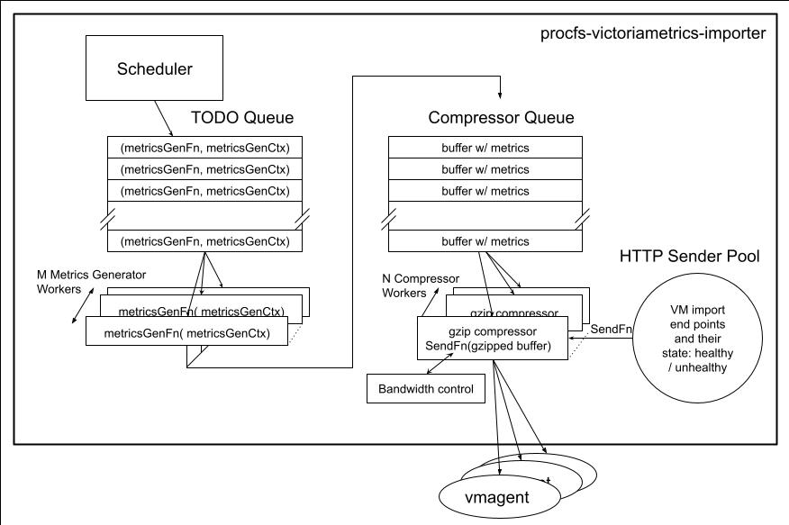

# procfs-victoriametrics-importer

An utility for importing granular Linux <a href="https://linux.die.net/man/5/proc" target="_blank">proc</a> stats into <a href="https://docs.victoriametrics.com/Cluster-VictoriaMetrics.html" target="_blank">VictoriaMetrics</a>

# Motivation And Solution

Financial institutions use so called Market Data Platforms for disseminating live financial information. Such platforms may be latency sensitive, in that the data transition time between producers (typically external feeds) and consumers (typically an automated trading systems) has to be less than a given threshold at all times, typically < 1 millisecond. Latency spikes are usually created by resource bound conditions, leading to queuing, or by errors/discards, leading to retransmissions. Given the low threshold of latency, the telemetry data for the systems have to be sufficiently granular, time wise, to be of any use. For instance a 100% CPU condition for a thread that lasts 1 second could explain a 20 millisecond latency jump. If the sampling period were 5 seconds, the same thread would show 20% CPU utilization, thus masking the resource bound condition.

<a href="https://docs.victoriametrics.com/Cluster-VictoriaMetrics.html" target="_blank">VictoriaMetrics</a> does en excellent job (based on our experience at OpenAI) in handling large numbers of time series and given its integration w/ <a href="https://grafana.com/grafana/" target="_blank">Grafana</a> and its query language, <a href="https://docs.victoriametrics.com/MetricsQL.html" target="_blank">MetricsQL</a>, a superset of <a href="https://prometheus.io/docs/prometheus/latest/querying/basics/" target="_blank">PromQL</a>, it is a  perfect candidate for storing the metrics.

The widely used approach of scraping for collecting metrics would be suboptimal in this case, given the 100 millisecond .. 1 second time granularity of the latter. 

Since VictoriaMetrics supports the [import](https://docs.victoriametrics.com/Cluster-VictoriaMetrics.html#url-format) paradigm, it is more efficient to collect the granular stats, with the timestamps of the actual collection, into larger batches and to push the latter, in compressed format, to import end points.

# Architecture

## Diagram

## Components
### Scheduler
The scheduler is responsible for determining the next (the  nearest in time, that is) units of work that need to be done. A unit of work is represented by a  **MetricsGenContext**, which is added to the **TODO Queue**.

### TODO Queue
A Golang channel storing the units of work, written by the **Scheduler** and read by worker. This allows the parallelization of metrics generation.

### MetricsGenContext

**MetricsGenContext** is a container for configuration, state and stats. Each metrics generator function has its specific context (not to be confused with the Golang Standard Library one).

Each such object has a **GenerateMetrics()** method capable of parsing [/proc](https://man7.org/linux/man-pages/man5/proc.5.html) information into [Prometheus exposition text format](https://github.com/prometheus/docs/blob/main/content/docs/instrumenting/exposition_formats.md#text-based-format). 

The generated metrics are packed into buffers, until the latter reach ~ 64k in size (the last buffer of the scan may be shorter, of course). The buffers are written into the **Compressor Queue**

### Compressor Queue

A Golang channel with metrics holding buffers from all metrics generator functions, which are its writers. The readers are gzip compressor workers. This approach has 2 benefits:
* it supports the parallelization of compression
* it allows more efficient packing by consolidating metrics across all generator functions, compared to individual compression inside the latter.

## Compressor Workers

They perform gzip compression until either the compressed buffer reaches ~ 64k in size, or the partially compressed data becomes older than N seconds (time based flush, that is). Once a compressed buffer is ready to be sent, the compressor uses **SendFn**, the sender method of the **HTTP Sender Pool**, to ship it to an import end point.

## HTTP Sender Pool and SendFn

The **HTTP Sender Pool** holds information and state about all the configured VictoriaMetrics end points. The end points can be either healthy or unhealthy. If a send operation fails, the used end point is moved to the unhealthy list. The latter is periodically checked by health checkers and end points that pass the check are moved back to the healthy list. **SendFn** is a method of the **HTTP Sender Pool** and it works with the latter to maintain the healthy / unhealthy lists. The **Compressor Workers** that actually invoke **SendFn** are unaware of these details, they are simply informed that the compressed buffer was successfully sent or that it was discarded (after a number of attempts). The healthy end points are used in a round robin fashion to spread the load across all of the VictoriaMetrics import end points.

## Bandwidth Control

The **Bandwidth Control** implements a credit based mechanism to ensure that the egress traffic across all **SendFn** invocations does not exceed a certain limit. This is useful in smoothing bursts when all metrics are generated at the same time, e.g. at start.

# Implementation Considerations

## The Three Laws Of Stats Collection

1. **First Do No Harm:** The collectors should have a light footprint in terms of resources: no CPU or memory hogs, no I/O blasters, no DDoS attack on the metrics database,  etc. Anyone who has had the computer rendered irresponsive by a "lightweight" virus scanner, will intuitively understand and relate.
1. **Be Useful:** Collect only data that might have a use case.
1. **Be Comprehensive:** Collect **all** potentially useful data, even if it may be needed once in the lifetime of the system; that single use may save the day.

## Resource Utilization Mitigation Techniques

### Reusable Objects And The Double Buffer

Typical parsers of `/proc` files will create and return a new object w/ the parsed data for every invocation. However most of the files have a fixed structure [^1] so the data could be stored in a previously created object, thus avoiding the pressure on the garbage collector.

Additionally certain metrics generators may need to refer the previous scan values. The double buffer approach will rely on a `parsedObjects [2]*ParsedObjectType` array in the generator context together with a `currentIndex` integer that's toggled between `0` and `1` at every scan. `parsedObjects[currentIndex]` will be passed to the parser to retrieve the latest data and `parsedObjects[1 - currentIndex]` will represent the previous scan.

[^1]: The fixed structure applies for a given kernel version, i.e. it is fixed for the uptime of a given host. 

### Reducing The Number Of Data Points

#### Delta v. Refresh

In order to reduce the traffic between the importer and the import endpoints, only the metrics whose values have changed from the previous scan are being generated and sent. That requires that queries be made using the [last_over_time(METRIC[RANGE_INTERVAL])](https://prometheus.io/docs/prometheus/latest/querying/functions/#aggregation_over_time) function and to make the range interval predictable, all metrics have a guaranteed refresh interval, when a metric is being generated regardless of its lack of change from the previous scan.

Each metrics generator is configured with 2 intervals: _scan_ and _refresh_. The ratio N = _refresh_ / _scan_ is called _refresh\_factor_ and it means that a specific metric will be generated every N scans.

Ideally the refresh cycles should be spread evenly across all metrics provided by a specific generator, leading to the following approach:

* each metric is associated with a _refresh\_group\_num_, 0..N-1. This is a cyclic number assigned first time when the object to which the metric belongs is being discovered and it is incremented modulo N after each use
* each scan has a _refresh\_cycle\_num_, 0..N-1. This is a cyclic counter incremented modulo N after each scan
* metrics that have _refresh\_group\_num_ == _refresh\_cycle\_num_ will be generated part of the refresh

Since the association of a particular metric with a  _refresh\_group\_num_ is unchanged for the lifetime of the metric, the metric is guaranteed to be generated at least every Nth scan.

Since the _refresh\_group\_num_, assigned at object creation, is incremented modulo N afterwards, this will lead to the spread of the full refresh for the metrics associated with those objects over N cycles.

**Note:** The delta approach can be disabled by setting the _refresh_ interval to 0.

e.g.

Let's consider the case of the `proc_pid_metrics` generator w/ N, the refresh factor, = 15 and with the  _new\_refresh\_group\_num_, the next _refresh\_group\_num_ to be assigned, = 12. In the current scan 5 new PIDs are being discovered: 1001, 1002, 1003, 1004 and 1005. The _refresh\_group\_num_ assignment will be as following:
| PID | _refresh\_group\_num_ |
| ---: | ---------------------: |
| 1001 | 12 |
| 1002 | 13 |
| 1003 | 14 |
| 1004 | 0 |
| 1005 | 1 |

Thus each of the new PID will have a full refresh in a **different** scan cycle.

#### Active Processes/Threads

In addition to the delta approach, process/thread metrics use the concept of active process to further reduce the number of metrics. PIDs/TIDs are classified into active/inactive based upon %CPU since the previous scan >= _active\_threshold_. Memory and I/O stats are parsed and the associated metrics are generated only for active PIDs/TIDs.

**Note** The active process check can be disabled by setting _active\_threshold_ to 0.

## Handling Large/High Precision Values

Certain metrics have values that would exceed the 15 (15.95) precision of `float64`, e.g. `uint64`. Such values will be split in two metrics, `..._low32` and `..._high32` where `low32` == `value & 0xffffffff` and `high32` = `value >> 32`. This is useful for deltas or rates where the operation is applied 1st to each of the 2 halves which are then combined. e.g.: `delta = delta(high32) * 4294967296 + delta(low32)`, with the underlying assumption that the delta is fairly small. This is how the byte count is handled for interfaces.

