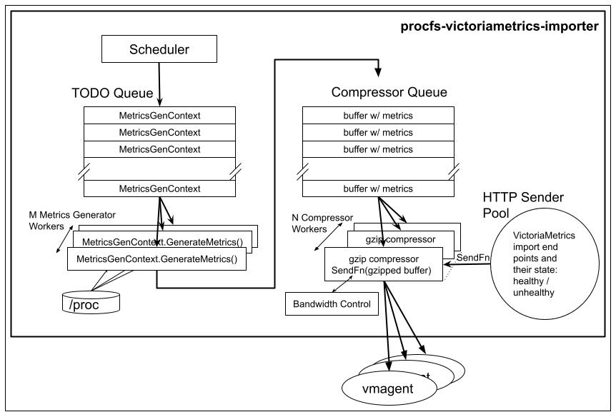

# procfs-victoriametrics-importer

An utility for importing granular Linux <a href="https://linux.die.net/man/5/proc" target="_blank">proc</a> stats into <a href="https://docs.victoriametrics.com/Cluster-VictoriaMetrics.html" target="_blank">VictoriaMetrics</a>

# Motivation And Solution

Financial institutions use so called Market Data Platforms for disseminating live financial information. Such platforms may be latency sensitive, in that the data transition time between producers (typically external feeds) and consumers (typically an automated trading systems) has to be less than a given threshold at all times, typically < 1 millisecond. Latency spikes are usually created by resource bound conditions, leading to queuing, or by errors/discards, leading to retransmissions. Given the low threshold of latency, the telemetry data for the systems have to be sufficiently granular, time wise, to be of any use. For instance a 100% CPU condition for a thread that lasts 1 second could explain a 20 millisecond latency jump. If the sampling period were 5 seconds, the same thread would show 20% CPU utilization, thus masking the resource bound condition.

<a href="https://docs.victoriametrics.com/Cluster-VictoriaMetrics.html" target="_blank">VictoriaMetrics</a> does en excellent job (based on our experience at OpenAI) in handling large numbers of time series and given its integration w/ <a href="https://grafana.com/grafana/" target="_blank">Grafana</a> and its query language, <a href="https://docs.victoriametrics.com/MetricsQL.html" target="_blank">MetricsQL</a>, a superset of <a href="https://prometheus.io/docs/prometheus/latest/querying/basics/" target="_blank">PromQL</a>, it is a  perfect candidate for storing the metrics.

The widely used scraping approach for collecting metrics would be suboptimal in this case, given the 100 millisecond .. 1 second time granularity of the latter. 

Since VictoriaMetrics supports imports as well, a more efficient approach is to collect the granular stats into a larger batch and to send it in compressed form to import end points.

# Architecture

## Diagram

## Components
### Scheduler
The scheduler is responsible for determining the next (the  nearest in time, that is) units of work that need to be done. A unit of work is represented by the pair **(metricsGenFn, metricsGenCtx)**, which is added to the **TODO Queue**.

### TODO Queue
A Golang channel storing the units of work, written by the **Scheduler** and read by worker goroutines. This is in order to support the parallelization of metrics generation.

### MetricsGenFn and metricsGenCtx

**MetricsGenFn** are functions capable of parsing [/proc](https://man7.org/linux/man-pages/man5/proc.5.html) information into [Prometheus exposition text format](https://github.com/prometheus/docs/blob/main/content/docs/instrumenting/exposition_formats.md#text-based-format). The functions operate in the context of **metricsGenCtx**, which a container for configuration, state and stats. Each metrics generator function has its specific context (not to be confused with the Golang Standard Library
 one).

The generated metrics are packed into buffers, until the latter reach ~ 64k in size (the last buffer of the scan may be shorter, of course). The buffers are written into the **Compressor Queue**

### Compressor Queue

A Golang channel with metrics holding buffers from all metrics generator functions, which are its writers. The readers are gzip compressor workers. This approach has 2 benefits:
* it supports the parallelization of compression
* it allows more efficient packing by consolidating metrics across all generator functions, compared to individual compression inside the latter.

## Compressor Workers

They perform gzip compression until either the compressed buffer reaches ~ 64k in size, or the partially compressed data becomes older than N seconds (time based flush, that is). Once a compressed buffer is ready to be sent, the compressor uses **SendFn**, the sender method of the **HTTP Sender Pool**, to ship it to an import end point.

## HTTP Sender Pool and SendFn

The **HTTP Sender Pool** holds information and state about all the configured VictoriaMetrics end points. The end points can be either healthy or unhealthy. If a send operation fails, the used end point is moved to the unhealthy list. The latter is periodically checked by health checkers and end points that pass the check are moved back to the healthy list. **SendFn** is a method of the **HTTP Sender Pool** and it works with the latter to maintain the healthy / unhealthy lists. The **Compressor Workers** that actually invoke **SendFn** are unaware of these details, they are simply informed that the compressed buffer was successfully sent or that it was discarded (after a number of attempts). The healthy end points are used in a round robin fashion to spread the load across all of the VictoriaMetrics import end points.

## Bandwidth Control

The **Bandwidth Control** implements a credit based mechanism to ensure that the egress traffic across all **SendFn** invocations does not exceed a certain limit. This is useful in smoothing bursts when all metrics are generated at the same time, e.g. at start.

